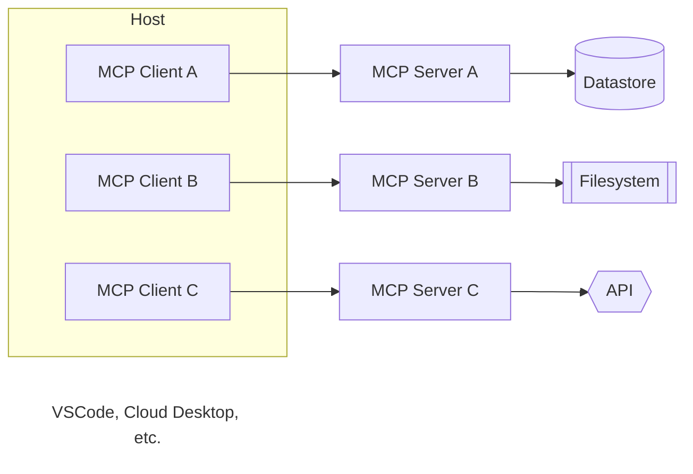

```mermaid
---
config:
  layout: dagre
---
flowchart LR
 subgraph Host["Host"]
        A["MCP Client A"]
        B["MCP Client B"]
        C["MCP Client C"]
  end
    A --> SA["MCP Server A"]
    B --> SB["MCP Server B"]
    C --> SC["MCP Server C"]
    SA --> DS[("Datastore")]
    SB --> FS[["Filesystem"]]
    SC --> API{{"API"}}
    n1["VSCode, Cloud Desktop, etc."]
    n1@{ shape: text}
```