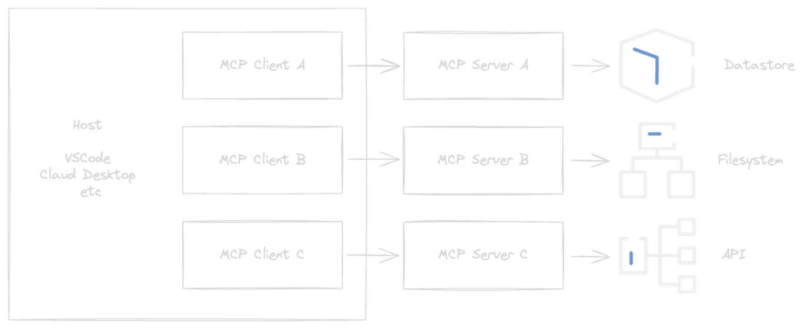

<!-- class: invert -->
# Github Copilot - How to Work in Agent Mode

## 🚀 Exciting demo on Agent Mode
## ⚡ Discover how Agent Mode can supercharge your coding workflow
## 💡 Practical tips

---

# A quick intro​

## 🔧 GHCP Completion
## 💬 GHCP Chat

---

# The challenge​

## 🌍 How to give Copilots access to the world?

---

# LLMs Are Disconnected from the World

## 📅 Training data cut off
## 🌐 Trained on public data
## 🚫 Cannot call APIs
## 🔍 Cannot search the web
## 🔒 No access to internal information

---

# Meet Your Host

## **Torsten Mahr** 
### Microsoft - Technology Strategist

### 💛 100% Commerzbank 💛

### 🔗 LinkedIn [https://www.linkedin.com/in/torstenmahr/](https://www.linkedin.com/in/torstenmahr/) 

---

# What is Agent Mode?

## 🤖 AI plans & performs multi-step tasks
## 🛠️ Invokes tools to edit files, run commands, test code, access data
## 👥 Like an AI pair-programmer
## ⚡ Can apply changes directly

---

# What is MCP?

## 🔌 Model Context Protocol
## 🌐 Lets Copilot talk to external tools & services
## 🎭 Examples: Playwright (browser automation), GitHub API
## ✨ Enables Copilot to run tests, create issues, more

---

---

# Setup (Prerequisites)

##  🔑 Copilot Chat & Agent Mode access
##  🔄 Update VS Code & Copilot extension
##  ⚙️ Enable `chat.agent` & `chat.mcp.enabled`
##  📦 Install MCP servers (e.g. Playwright)
##  🚀 Start MCP servers 
##  💡 **Tip**: Enable `chat.tools.autoApprove`

---

# Demo: Calculator

##  🎉 Let's have fun!

---

# Q&A

##  ❓ What workflows to automate?
##  🤔 Questions about Agent Mode or MCP?

---

# Thank You!

##  ⛵ Fair winds & happy coding, matey!
