<!-- class: invert -->

# Github Copilot - How to Work in Agent Mode

## 🚀 Exciting demo on Agent Mode

## ⚡ Discover how Agent Mode can supercharge your coding workflow

## 💡 Practical tips

---

# A quick intro​

## 🔧 GitHub Copilot Completion

## 💬 GitHub Copilot Chat

---

# The challenge​

## 🌍 How to give Copilots access to the world?

---

# LLMs Are Disconnected from the World

## 📅 Training data cut off

## 🌐 Trained on public data

## 🚫 Cannot call APIs

## 🔍 Cannot search the web

## 🔒 No access to internal information

---

# Meet Your Host

## **Torsten Mahr** 
### Microsoft - Technology Strategist

### 🔗 LinkedIn [https://www.linkedin.com/in/torstenmahr/](https://www.linkedin.com/in/torstenmahr/)

---

# What is Agent Mode?

## 🤖 AI plans & performs multi-step tasks

## 🛠️ Invokes tools to edit files, run commands, test code, access data

## 👥 Acts as an AI pair-programmer

## ⚡ **Benefit**: Reduces manual overhead, boosts productivity

---

# What is MCP?

## 🔌 Model Context Protocol (MCP)

## 🌐 Allows Copilot to communicate with external tools

### Examples:

- 🎭 Playwright: Automated browser tests
- 📂 GitHub API: Create and manage issues

## ✨ Enables Copilot to run tests, automate workflows, and more

---

---

# Setup (Prerequisites)

## 🔑 Copilot Chat & Agent Mode access

## 🔄 Update VS Code & Copilot extension

## 📦 Install MCP servers (e.g., Playwright)

## 🚀 Start MCP servers 

## 💡 **Tip:** Enable `chat.tools.autoApprove`

---

# Demo: Calculator

##  🎉 Let's have fun!

### We'll show:

- 🧮 Creating a basic calculator
- ✅ Automating tests via Playwright MCP
- ⚙️ Copilot performing automated code improvements

---

# Q&A

## ❓ What workflows to automate?

## 🤔 Questions about Agent Mode or MCP?

---

# Thank You!

##  ⛵ Fair winds & happy coding, matey!
